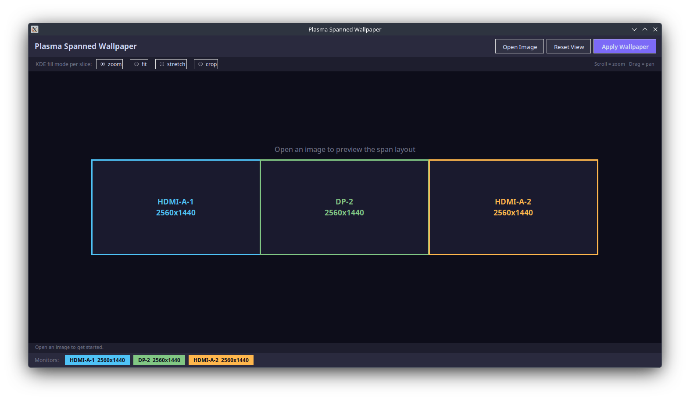
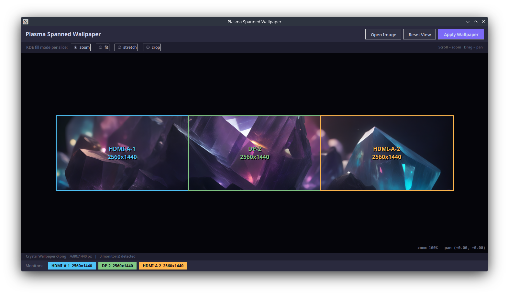
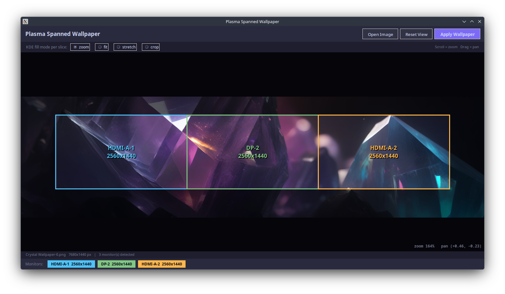

# Plasma-SpannedWallpaper

A GUI tool for KDE Plasma that spans a single image across multiple monitors as a wallpaper — a feature missing from Plasma's built-in wallpaper settings.
Being up front - this tool was almost entirely vibe coded. The concept is pretty simple and it's functional. The code is pretty straightforward as well so it should be pretty simple to correct any issues that arise.

## Features

- **Interactive viewfinder** — pan and zoom the source image before applying, with a live preview showing exactly what each monitor will display
- **Monitor overlays** — colour-coded outlines labelled with connector names and resolutions drawn over the preview
- **Smart slice paths** — each source image gets its own subdirectory named `<stem>_<hash>/`, so switching images always triggers a Plasma wallpaper reload and two files with the same name in different folders never collide
- **Connector-name matching** — wallpapers are applied to the correct physical display by connector name (e.g. `HDMI-A-1`, `DP-2`) rather than Plasma's internal screen index, which can differ from left-to-right order
- **Geometry fallback** — if `screenForConnector()` is unavailable (older Plasma builds), falls back to matching by screen geometry
- **Headless CLI mode** — full `--no-gui` path for scripting and automation
- **Graceful degradation** — if tkinter is unavailable, falls back to CLI mode automatically

## Dependencies

###System Packages:

Tkinter (GUI)
Python3

### Python Requirements:

Pillow>=9.0.0
screeninfo>=0.8.1

Can be installed using pip as below or with package manager
```bash
pip install -r requirements.txt
```


## Installation

```bash
# Copy the script to somewhere on your PATH ex:
cp plasma-spannedwallpaper.py ~/.local/bin/plasma-spannedwallpaper.py
chmod +x ~/.local/bin/plasma-spannedwallpaper.py
```

## Usage

### GUI mode (default)

```bash
# Open the GUI with no image preloaded
plasma-spannedwallpaper.py

# Open the GUI with an image preloaded
plasma-spannedwallpaper.py ~/Pictures/panorama.jpg
```

#### Controls

| Input | Action |
|---|---|
| Scroll wheel | Zoom in / out (15% – 600%) |
| Click + drag | Pan the image |
| **Open Image** button | Open a file picker |
| **Reset View** button | Restore automatic cover-fit, centred |
| **Apply Wallpaper** button | Slice and set wallpapers on all monitors |
| Fill mode radio buttons | Choose KDE fill mode per slice |

### CLI / headless mode

```bash
# Basic
plasma-spannedwallpaper.py image.jpg --no-gui

# Choose KDE fill mode (zoom | fit | stretch | crop)
plasma-spannedwallpaper.py image.jpg --no-gui --scale-mode fit

# Slice without applying (useful for inspection)
plasma-spannedwallpaper.py image.jpg --no-gui --dry-run

# Custom output directory for slices
plasma-spannedwallpaper.py image.jpg --no-gui --output-dir ~/my-wallpapers/
```

### All options

```
positional arguments:
  image                 Path to the image (optional in GUI mode)

options:
  --no-gui              Headless mode — requires image argument
  --scale-mode          KDE fill mode applied to each slice: zoom (default), fit, stretch, crop
  --output-dir          Where to save wallpaper slices (default: ~/.local/share/wallpapers/span/)
  --dry-run             Slice image but do not set wallpapers (CLI only)
```

## How it works

1. **Monitor detection** — reads each monitor's resolution and pixel offset via `screeninfo`, sorted left-to-right.
2. **Virtual canvas** — computes the bounding box covering all monitors (handles non-rectangular, stacked, and mixed-resolution layouts).
3. **Cover-fit + user adjustments** — scales the source image to fill the canvas with no black bars, then applies the user's zoom and pan on top.
4. **Slicing** — crops the exact pixel region for each monitor and saves it as a PNG to a per-image subdirectory.
5. **KDE integration** — uses `qdbus` to call `org.kde.PlasmaShell.evaluateScript`, matching each desktop by connector name first, falling back to screen geometry.

### Slice output structure

```
~/.local/share/wallpapers/span/
  mypanorama_a3f1b2c4/      ← stem + 8-char SHA-1 of absolute path
    HDMI-A-1.png
    DP-2.png
    HDMI-A-2.png
  wallpaper_9d2e7f81/        ← same filename, different folder = different hash
    HDMI-A-1.png
    ...
```

Slices are kept after applying because KDE references them by path — deleting them reverts the wallpaper.

## KDE fill modes

These control how KDE scales each slice within its monitor. Since each slice is already cropped precisely to the monitor's resolution, `zoom` (the default) is almost always the right choice.

| Mode | KDE value | Description |
|---|---|---|
| `zoom` | 6 | Scale to fill, maintain aspect ratio (default) |
| `fit` | 1 | Scale to fit, may leave bars |
| `stretch` | 0 | Stretch to fill, distorts aspect ratio |
| `crop` | 2 | Scale and crop to fill |


## Screenshots

Default view with 3 attached monitors:


Single triple monitor wallpaper loaded in:


Zoomed and panned view showing preview of how wallpaper will be applied to connected displays:

